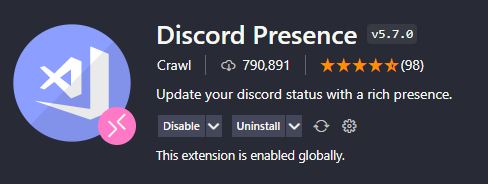
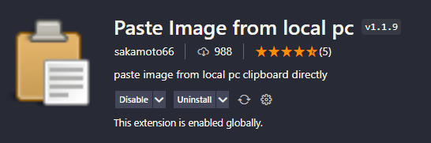
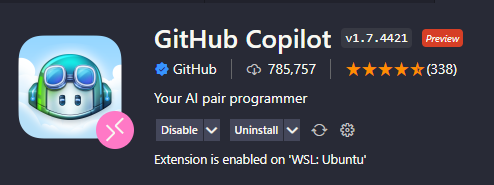

## Discord Presence

친구들에게 자신이 코딩하고 있다는걸 과시하고 싶을 때 접합!  
사실 쓸때 없고 자원 낭비긴한데... 멋있으니까 :)

## Paste Image from local pc

  
진짜 혁신이라고 할 수 있음!  
Jekyll 또는 Hugo등의 스태틱 블로그 글을 작성할때 필수임!  
스크린샷을 찍은 후 Ctrl + Alt + V 로 간단하게 이미지 삽입  
세상에 이런 기능이 있을줄 알았다면 내 블로그의 글들이 조금은 더 예뻤을텐데..

## GitHub Copilot

  
새로운 프래임워크나 언어를 공부할때
익숙하지 않은 문법을 입력하는 나의 느린 타자 속도를 완벽히 보완해줌
전부 좋은데 사용하기 위해선 배타테스터로 선정되어야 되고,
약간의 심각한 저작권 이슈가 존재함

## Remote - WSL

## Git History

## Meterial Icon Theme

## Dracula Official

## Code Runner
