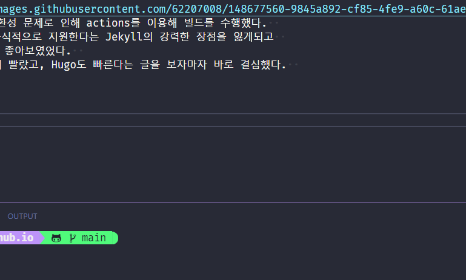

  
예전에 github pages 블로그를 처음 구축했을 당시에 Jekyll를 이용해 구축했다.  
그리고 마지막에 추가로 했던 말이 있다.

  
내가 고른 Jekyll 테마의 호환성 문제로 인해 actions를 이용해 빌드를 수행했다.  
하지만 github pages에서 공식적으로 지원한다는 Jekyll의 강력한 장점을 잃게되고  
차라리 hugo로 넘어가는 것이 좋아보였었다.  
또한 최근 배운 Go는 엄청나게 빨랐고, Hugo도 빠른다는 글을 보자마자 바로 결심했다.

### Hugo로 이전하자!

## 🗃️ Hugo로의 이동

